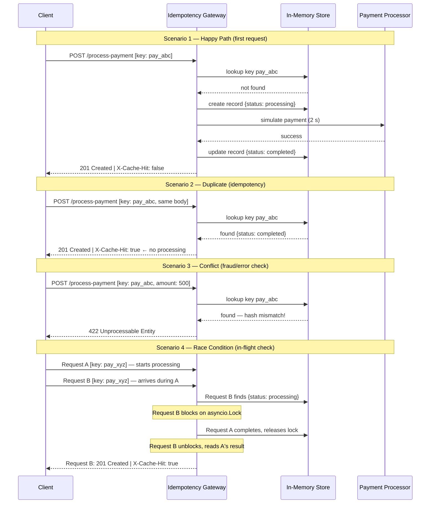

# FinSafe Idempotency Gateway — Pay-Once Protocol

> **A production-grade payment middleware that guarantees every transaction is processed exactly once, no matter how many times the client retries.**

Built with **FastAPI · Python 3.12 · asyncio** — includes an interactive browser dashboard for real-time testing.

---

## Table of Contents

1. [What This App Does](#what-this-app-does)
2. [How It Works — The 4 Scenarios](#how-it-works--the-4-scenarios)
3. [Architecture Diagrams](#architecture-diagrams)
4. [How to Run the App](#how-to-run-the-app)
5. [Using the Dashboard](#using-the-dashboard)
6. [API Documentation](#api-documentation)
7. [Running Tests](#running-tests)
8. [Design Decisions](#design-decisions)
9. [Developer's Choice — Automatic Key Expiry (TTL)](#developers-choice--automatic-key-expiry-ttl)
10. [Project Structure](#project-structure)

---

## What This App Does

E-commerce platforms occasionally experience network timeouts when sending payment requests. When this happens, their servers automatically retry — which can cause a customer to be charged twice for the same purchase.

**FinSafe Idempotency Gateway** solves this by acting as a protective layer between the client and the payment processor. Every payment request must include a unique `Idempotency-Key` header. The gateway uses this key to:

- **Process** the payment on the first request and store the result.
- **Replay** the stored result instantly on any retry — without charging again.
- **Reject** any attempt to reuse the same key for a different payment (fraud/error protection).
- **Handle** simultaneous duplicate requests safely using async locks.

---

## How It Works — The 4 Scenarios

### Scenario 1 — First Request (Happy Path)
The client sends a payment with a new unique key. The gateway processes it (2-second simulation), stores the result, and returns `201 Created` with `X-Cache-Hit: false`.

### Scenario 2 — Duplicate Retry (Idempotency)
The client resends the exact same key and body (e.g., after a timeout). The gateway detects the stored result and returns it instantly — **no second charge** — with `X-Cache-Hit: true`.

### Scenario 3 — Conflict (Fraud / Error Check)
The client reuses an existing key but changes the amount or currency. The gateway detects the SHA-256 hash mismatch and returns `422 Unprocessable Entity`. The client must generate a new key to proceed with a different payment.

### Scenario 4 — Race Condition (In-Flight Check)
Two requests with the same key arrive simultaneously. Request A starts processing. Request B arrives during the 2-second window, finds the record in `processing` state, and blocks on the `asyncio.Lock`. When Request A finishes, Request B unblocks and returns the same result — both responses share the same `transaction_id`.

---

## Architecture Diagrams

### Flowchart — Idempotency Decision Logic


### Sequence Diagram — All Four Scenarios



---

## How to Run the App

### Requirements

- Python 3.10 or higher
- pip

### Option A — Run Locally (Recommended)

```bash
# 1. Clone the repository
git clone https://github.com/ngamije30/FinSafe-Idempotency-Gateway.git
cd idempotency-gateway

# 2. Create and activate a virtual environment (Optional):
python -m venv venv

# On Mac/Linux (Optional):
source venv/bin/activate

# On Windows (Optional):
venv\Scripts\activate

# 3. Install dependencies
pip install -r requirements.txt

# 4. Copy the environment variables file (Optional)
cp .env.example .env

# 5. Start the server
uvicorn app.main:app --reload --port 8000
```

The server starts at **http://localhost:8000**

| URL | What you get |
|---|---|
| `http://localhost:8000` | Interactive dashboard |
| `http://localhost:8000/docs` | Swagger UI (API docs) |
| `http://localhost:8000/health` | Health check |

### Option B — Docker

```bash
docker compose up --build
```

The server will be available at **http://localhost:8000** — no Python installation needed.

### Environment Variables

All settings are optional. Copy `.env.example` to `.env` to override defaults.

| Variable | Default | Description |
|---|---|---|
| `PROCESSING_DELAY` | `2.0` | Simulated payment delay in seconds |
| `IDEMPOTENCY_KEY_TTL` | `86400` | Key expiry in seconds (24 hours) |
| `CLEANUP_INTERVAL` | `3600` | Background cleanup interval in seconds (1 hour) |

---

## Using the Dashboard

Open **http://localhost:8000** in your browser. The dashboard has three working tabs:

### Dashboard Tab
The main overview. Shows:
- **Live stats** — total requests, cache hits, in-flight waits, conflicts blocked (auto-refresh every 5 seconds)
- **New Payment Request** form — enter an amount, pick a currency (includes all East African currencies), and send
- **Response panel** — shows the full JSON response with status badge and headers
- **Recent Transactions** — last 5 records with a "View All →" link

**Scenario buttons on the form:**

| Button | What it does |
|---|---|
| ⟳ Retry Same | Re-sends the last key + body → triggers cache hit |
| ⚡ Conflict Test | Re-sends the last key with a different amount → triggers 422 |
| 🏁 Race Condition | Fires two identical requests simultaneously → tests in-flight lock |
| ✦ New Key | Generates a fresh UUID idempotency key |

**What to do when you get a 422 Conflict:**
- Click **✦ New Key** to generate a new key and submit a fresh payment, OR
- Click **⟳ Retry Same** to replay the original payment using the cached result

### Requests Tab
A dedicated payment testing workspace with its own independent form and response panel. Also shows a **Session Request Log** — a table of every API call made during the current browser session, including status, cache hit flag, and response time.

### Transactions Tab
The full transaction ledger:
- All idempotency records stored on the server
- Live search by key or transaction ID
- Status badges: ✓ Completed · ··· Processing · ⊕ Cached
- TTL countdown showing how long each key remains valid
- Pagination (15 rows per page)

### Supported Currencies

The app supports **East African currencies** as the primary options, plus major international currencies:

**East Africa:** KES · TZS · UGX · RWF · BIF · ETB · SSP · SOS · DJF · ERN · MGA · MUR · SCR · KMF · ZMW · MWK · MZN

**Other:** GHS · USD · EUR · GBP · NGN

---

## API Documentation

### `POST /process-payment`

Process a payment with full idempotency protection.

**Headers**

| Header | Required | Description |
|---|---|---|
| `Idempotency-Key` | Yes | Unique string per payment attempt |
| `Content-Type` | Yes | `application/json` |

**Request Body**

```json
{ "amount": 100.00, "currency": "KES" }
```

| Field | Type | Rules |
|---|---|---|
| `amount` | float | Must be greater than 0 |
| `currency` | string | Exactly 3 characters (ISO 4217) |

**Responses**

| Scenario | Status | `X-Cache-Hit` | Notes |
|---|---|---|---|
| First request | 201 | `false` | Payment processed and stored |
| Duplicate retry (same key + body) | 201 | `true` | Instant replay, no re-processing |
| Conflict (same key, different body) | 422 | — | Generate a new key to proceed |
| Missing `Idempotency-Key` header | 400 | — | Header is required |

**Example — First request**

```bash
curl -i -X POST http://localhost:8000/process-payment \
  -H "Content-Type: application/json" \
  -H "Idempotency-Key: pay-001" \
  -d '{"amount": 100, "currency": "KES"}'
```

```json
{
  "status": "success",
  "message": "Charged 100.0 KES",
  "transaction_id": "3fa85f64-5717-4562-b3fc-2c963f66afa6",
  "amount": 100.0,
  "currency": "KES",
  "processed_at": 1714236000.123
}
```

**Example — Duplicate retry (cache hit)**

```bash
# Same key, same body — instant response, no second charge
curl -i -X POST http://localhost:8000/process-payment \
  -H "Content-Type: application/json" \
  -H "Idempotency-Key: pay-001" \
  -d '{"amount": 100, "currency": "KES"}'

# X-Cache-Hit: true
```

**Example — Conflict (same key, different amount)**

```bash
curl -i -X POST http://localhost:8000/process-payment \
  -H "Content-Type: application/json" \
  -H "Idempotency-Key: pay-001" \
  -d '{"amount": 500, "currency": "KES"}'

# HTTP 422 — "Idempotency key already used for a different request body."
```

---

### `GET /transactions`

Returns all active (non-expired) idempotency records.

```bash
curl http://localhost:8000/transactions
```

---

### `GET /stats`

Returns live counters for the current server session.

```bash
curl http://localhost:8000/stats
```

```json
{
  "total_requests": 12,
  "cache_hits": 8,
  "conflicts": 1,
  "in_flight_waits": 2,
  "active_keys": 7
}
```

---

### `GET /health`

```bash
curl http://localhost:8000/health
```

```json
{ "status": "healthy", "service": "Idempotency Gateway", "version": "1.0.0" }
```

---

## Running Tests

```bash
pytest -v
```

Expected output: **11 tests, all passing.**

| Test | Covers |
|---|---|
| `test_health_check` | Server is up |
| `test_first_payment_returns_201` | Happy path |
| `test_missing_idempotency_key_returns_400` | Missing header validation |
| `test_invalid_amount_returns_422` | Negative amount validation |
| `test_duplicate_returns_cached_response` | Cache hit + `X-Cache-Hit: true` |
| `test_duplicate_response_is_identical` | Exact response replay |
| `test_same_key_different_body_returns_422` | Conflict detection (amount) |
| `test_same_key_different_currency_returns_422` | Conflict detection (currency) |
| `test_concurrent_requests_return_same_transaction_id` | Race condition lock |
| `test_stats_counts_correctly` | Stats counters |
| `test_transactions_ledger_contains_record` | Ledger endpoint |

---

## Design Decisions

### Why `asyncio.Lock` for race-condition prevention?

FastAPI runs on a single-threaded async event loop. When two requests for the same key arrive simultaneously, both try to acquire the `asyncio.Lock` stored inside the `IdempotencyRecord`. Only one succeeds — the other suspends at `await lock.acquire()` until the first releases. This is simpler and cheaper than a database advisory lock or Redis mutex, and is correct for a single-process server.

> **Note:** For multi-worker deployments (`uvicorn --workers 4`), the lock must be promoted to a distributed one (e.g., Redis `SET … NX PX`). The store interface makes this swap straightforward.

### Why SHA-256 hash the request body?

The idempotency key alone does not prove the client is retrying the same request. The SHA-256 hash of the canonicalised (sorted-keys) JSON body is stored alongside each record. A mismatch returns 422, protecting against:
- Accidental key reuse for a different transaction
- Intentional fraud (inflating an amount under an already-approved key)

### Why FastAPI over Flask or Django?

- Native `async/await` support is required for the lock-based in-flight check.
- Pydantic validates request bodies (negative amounts, wrong currency length) before business logic runs.
- Auto-generated OpenAPI docs at `/docs` are available out of the box.

---

## Developer's Choice — Automatic Key Expiry (TTL)

### What was added

Every idempotency record is stamped with an `expires_at` timestamp (default: **24 hours**, configurable via `IDEMPOTENCY_KEY_TTL`). A background `asyncio` task runs every hour (`CLEANUP_INTERVAL`) and evicts all expired records. The TTL countdown is visible in the Transaction Ledger on the dashboard.

### Why it matters for a real Fintech

| Problem without TTL | How TTL solves it |
|---|---|
| Store grows forever — eventual out-of-memory crash | Bounded memory: old records are auto-evicted |
| Clients can never safely reuse old key names | After 24h a key is forgotten; retry is safe |
| No alignment with industry standards | Matches Stripe, Adyen, and Braintree (all use 24h) |

The 24-hour window is large enough to absorb any realistic network-timeout retry loop, yet short enough to keep the store lean in production.

```bash
# Configurable via .env
IDEMPOTENCY_KEY_TTL=86400   # 24 hours (default)
CLEANUP_INTERVAL=3600       # cleanup runs every 1 hour
```

---

## Project Structure

```
idempotency-gateway/
├── app/
│   ├── main.py          # FastAPI app, CORS middleware, lifespan, TTL cleanup task
│   ├── config.py        # Pydantic-Settings — env-driven configuration
│   ├── schemas.py       # Request and response Pydantic models
│   ├── store.py         # In-memory idempotency store, SHA-256 hashing, stats
│   └── routes/
│       └── payments.py  # POST /process-payment, GET /transactions, /stats, /health
├── static/
│   └── index.html       # Interactive dashboard (Dashboard, Requests, Transactions tabs)
├── tests/
│   ├── conftest.py      # Auto-reset store + zero processing delay fixture
│   └── test_payments.py # 11 acceptance tests covering all user stories
├── Dockerfile
├── docker-compose.yml
├── requirements.txt
└── .env.example
```
