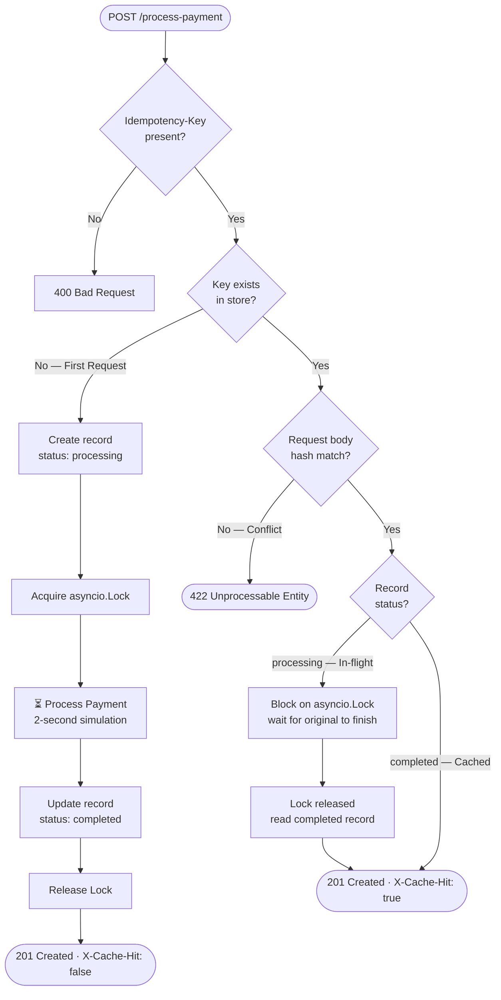
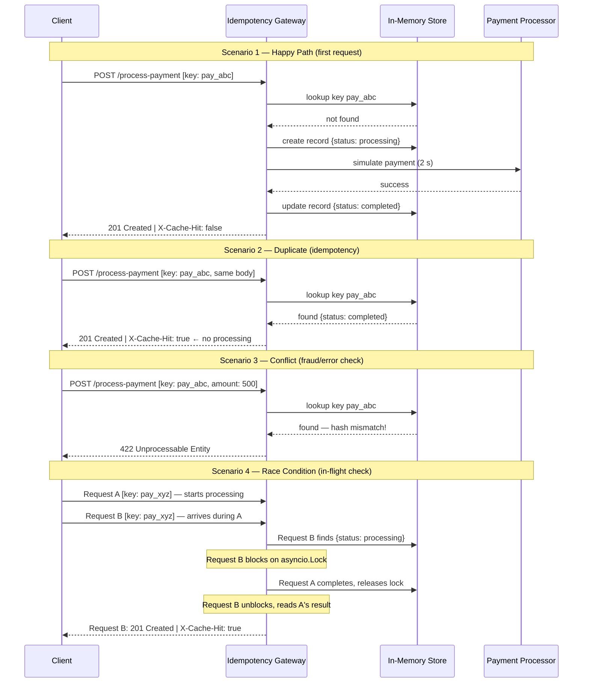

# FinSafe Idempotency Gateway — Pay-Once Protocol

> **A production-grade middleware that guarantees every payment is processed exactly once, no matter how many times the client retries.**

Built with **FastAPI · Python 3.12 · asyncio** — zero external dependencies required.

---

## Architecture Diagram

### Flow Chart — Idempotency Decision Logic



### Sequence Diagram — All Four Scenarios



---

## Setup Instructions

### Option A — Run locally (Python)

```bash
# 1. Clone your fork
git clone https://github.com/<your-username>/idempotency-gateway.git
cd idempotency-gateway

# 2. Create and activate a virtual environment
python -m venv venv
source venv/bin/activate        # Windows: venv\Scripts\activate

# 3. Install dependencies
pip install -r requirements.txt

# 4. (Optional) Copy and edit environment variables
cp .env.example .env

# 5. Start the server
uvicorn app.main:app --reload --port 8000
```

Visit **http://localhost:8000** — the interactive dashboard opens automatically.  
Interactive API docs are at **http://localhost:8000/docs**.

### Option B — Docker

```bash
docker compose up --build
```

---

## API Documentation

### `POST /process-payment`

Process a payment with idempotency protection.

**Headers**

| Header            | Required | Description                        |
|-------------------|----------|------------------------------------|
| `Idempotency-Key` | ✅ Yes   | Unique string per payment attempt  |
| `Content-Type`    | ✅ Yes   | `application/json`                 |

**Request body**

```json
{ "amount": 100.00, "currency": "GHS" }
```

| Field      | Type   | Constraints              |
|------------|--------|--------------------------|
| `amount`   | float  | > 0                      |
| `currency` | string | Exactly 3 characters     |

**Responses**

| Scenario                     | Status | `X-Cache-Hit` | Notes                              |
|------------------------------|--------|---------------|------------------------------------|
| First request                | 201    | `false`       | Payment processed, result stored   |
| Duplicate (same key + body)  | 201    | `true`        | Instant replay, no re-processing   |
| Conflict (same key, new body)| 422    | —             | Key reuse for different payload    |
| Missing header               | 400    | —             | `Idempotency-Key` is required      |

**Example — first request**

```bash
curl -X POST http://localhost:8000/process-payment \
  -H "Content-Type: application/json" \
  -H "Idempotency-Key: pay_$(uuidgen)" \
  -d '{"amount": 100, "currency": "GHS"}'
```

```json
{
  "status": "success",
  "message": "Charged 100.0 GHS",
  "transaction_id": "3fa85f64-5717-4562-b3fc-2c963f66afa6",
  "amount": 100.0,
  "currency": "GHS",
  "processed_at": 1714236000.123
}
```

**Example — duplicate (cache hit)**

```bash
# Same key, same body — returns the same response instantly
curl -X POST http://localhost:8000/process-payment \
  -H "Content-Type: application/json" \
  -H "Idempotency-Key: pay_same-key-as-above" \
  -d '{"amount": 100, "currency": "GHS"}'
# Response-Header: X-Cache-Hit: true
```

---

### `GET /transactions`

Returns all active idempotency records (unexpired only).

```bash
curl http://localhost:8000/transactions
```

---

### `GET /stats`

Returns live counters for the current server session.

```json
{
  "total_requests":  12,
  "cache_hits":       8,
  "conflicts":        1,
  "in_flight_waits":  2,
  "active_keys":      7
}
```

---

### `GET /health`

```json
{ "status": "healthy", "service": "Idempotency Gateway", "version": "1.0.0" }
```

---

## Running Tests

```bash
pytest -v
```

The test suite covers:

| Test                                         | User Story          |
|----------------------------------------------|---------------------|
| `test_first_payment_returns_201`             | US 1 — Happy Path   |
| `test_missing_idempotency_key_returns_400`   | US 1 — Validation   |
| `test_duplicate_returns_cached_response`     | US 2 — Cache Hit    |
| `test_duplicate_response_is_identical`       | US 2 — Exact replay |
| `test_same_key_different_body_returns_422`   | US 3 — Conflict     |
| `test_same_key_different_currency_returns_422` | US 3 — Conflict   |
| `test_concurrent_requests_return_same_transaction_id` | Bonus — Race |
| `test_stats_counts_correctly`                | Admin               |
| `test_transactions_ledger_contains_record`   | Admin               |

---

## Design Decisions

### Why asyncio.Lock for race-condition prevention?

FastAPI runs on an async event loop (single-threaded). When two requests for the same key arrive simultaneously, both try to acquire the `asyncio.Lock` stored inside the `IdempotencyRecord`. Only one succeeds; the other suspends at `await lock.acquire()` until the first releases. This is cheaper and simpler than a database advisory lock or a Redis `SETNX` mutex, and it is **correct** for a single-process server.

> **Note:** For a multi-worker deployment (e.g., `uvicorn --workers 4`), the lock must be promoted to a distributed one (e.g., Redis `SET … NX PX`). The store interface makes this a straightforward swap.

### Why hash the request body?

The idempotency key alone does not prove the client is retrying the same request. SHA-256 of the canonicalised (sorted-keys) JSON body is stored with each record. A mismatch returns 422, protecting against:
- Accidental key reuse for a different transaction
- Intentional fraud (inflating an amount under an already-issued key)

### Why FastAPI over Flask or Django?

- Native `async/await` support is essential for the lock-based in-flight check.
- Pydantic input validation catches bad payloads (negative amounts, wrong currency length) before they reach business logic.
- Auto-generated OpenAPI docs at `/docs` aid reviewers.

---

## Developer's Choice — Automatic Key Expiry (TTL)

### What was added

Every idempotency record is stamped with an `expires_at` timestamp (default: **24 hours** from creation, configurable via `IDEMPOTENCY_KEY_TTL`). A background `asyncio` task wakes up every hour (`CLEANUP_INTERVAL`) and evicts all expired records.

### Why it matters for a real Fintech

| Problem without TTL                              | How TTL solves it                              |
|--------------------------------------------------|------------------------------------------------|
| Store grows forever — eventual OOM crash         | Bounded memory: old records are auto-evicted   |
| Clients can never safely reuse old key names     | After 24 h a key is forgotten; retry is safe   |
| No alignment with industry standards             | Matches Stripe, Adyen, and Braintree (all 24 h)|

The 24-hour window is large enough to absorb any realistic network-timeout retry loop, yet short enough that the store stays lean in production.

```python
# Configurable via environment variable
IDEMPOTENCY_KEY_TTL=86400   # 24 h (default)
CLEANUP_INTERVAL=3600       # run cleanup every 1 h
```

---

## Project Structure

```
idempotency-gateway/
├── app/
│   ├── main.py          # FastAPI app, CORS, lifespan, TTL cleanup task
│   ├── config.py        # Pydantic-Settings: env-driven configuration
│   ├── schemas.py       # Request / response Pydantic models
│   ├── store.py         # In-memory idempotency store + stats
│   └── routes/
│       └── payments.py  # POST /process-payment, GET /transactions, /stats, /health
├── static/
│   └── index.html       # Interactive dark-theme testing dashboard
├── tests/
│   ├── conftest.py      # Auto-reset store + zero processing delay
│   └── test_payments.py # Full acceptance test suite (all 5 user stories)
├── Dockerfile
├── docker-compose.yml
├── requirements.txt
└── .env.example
```
